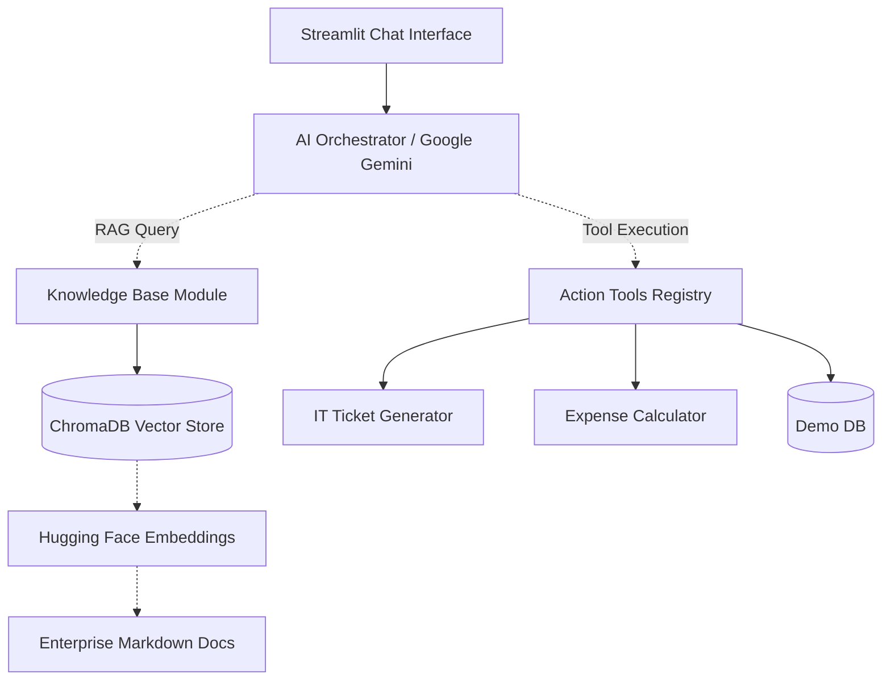

# Enterprise AI Operations Copilot

An enterprise-grade, agent-driven AI Copilot designed to drastically reduce operational overhead. By combining **Retrieval-Augmented Generation (RAG)** with dynamic **Tool Calling**, this Copilot can autonomously consult internal company policies and execute real-world operations via a unified, conversational interface.

---

## Key Features

- **Document-Grounded RAG:** Answers internal HR and IT policy queries by searching a local Vector Database, strictly avoiding hallucination. 
- **Agentic Actions:** Capable of seamlessly switching from conversational mode to execution mode (e.g., dynamically raising IT support tickets).
- **Mathematical Tooling:** Includes standalone calculators for determining net expense limits and tax compliance.
- **Enterprise-Ready:** Fully decoupled architecture featuring structured logging, custom error handling, and robust Pydantic validations. 

---

## System Architecture

The project leverages a highly modular architecture, decoupling the AI integration from the frontend logic and business tools.



---

## Tech Stack

- **Orchestration & Tools:** LangChain, Python, Pytest
- **Generative AI:** Google Gemini (`gemini-3.6-flash`) via `langchain-google-genai`
- **Retrieval & Storage:** ChromaDB, Hugging Face Sentence Transformers
- **Frontend & UI:** Streamlit

---

## Quickstart & Deployment

Deploying the Copilot locally takes less than a minute. Follow these exact steps:

### 1. Download the Project
```bash
git clone https://github.com/Alieno1/enterprise-ai-copilot.git
cd enterprise-ai-copilot
```

### 2. Prepare the Virtual Environment
Create an isolated environment and install the verified dependencies.
```bash
python -m venv .venv
source .venv/bin/activate    # Linux/MacOS
# .venv\Scripts\Activate     # Windows Users

pip install -r requirements.txt
```

### 3. Add API Credentials
The Copilot uses Google Gemini for its core reasoning capability. Create a `.env` file in the main folder and add your key:
```text
GOOGLE_API_KEY=your_google_gemini_api_key_here
```

### 4. Build the Local Knowledge Graph
Chunk and index the provided enterprise Markdown documents into the local ChromaDB vector store.
```bash
python scripts/build_vectorstore.py
```

### 5. Launch the Copilot
Start the conversational UI server.
```bash
streamlit run app/ui/app.py
```
Open `http://localhost:8501` in your browser and start chatting!

---

## Automated Verification

The intelligence engine and core logic are highly tested to ensure enterprise stability. Run the automated Pytest suite at any time:
```bash
PYTHONPATH=. pytest tests/
```

---

## Author

**Himanshu Singh**  

**Areas of Expertise:**
- **Artificial Intelligence:** Computer Science, AI/ML, Generative AI, Agentic AI, Computer Vision
- **Backend & Architecture:** Backend Engineering, Spring Boot, Distributed Systems

**Connect:**
- GitHub: [Alieno1](https://github.com/Alieno1)
